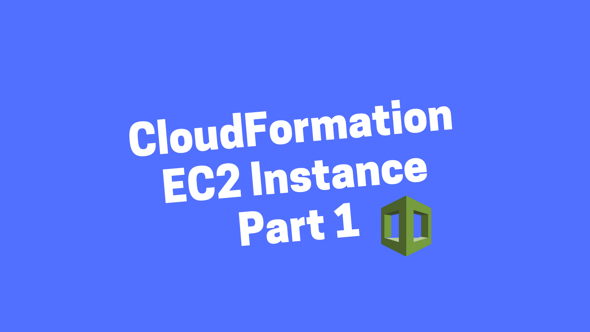
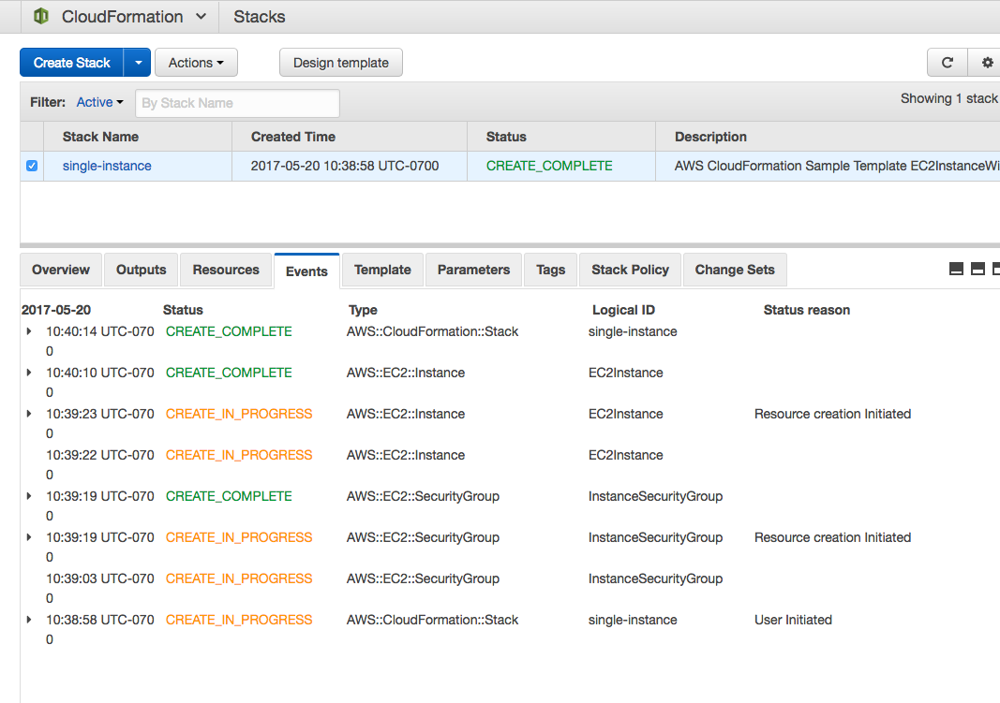
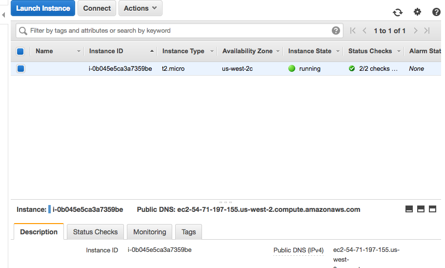

# A Simple Introduction to AWS CloudFormation Part 1: EC2 Instance

If are using AWS and want to automate creating resources you should look into AWS CloudFormation.

NOTE: All the source code for this post is available on Github: tongueroo/cloudformation-examples.
Stories in the series:

1. [A Simple Introduction to AWS CloudFormation Part 1: EC2 Instance](https://blog.boltops.com/2017/03/06/a-simple-introduction-to-aws-cloudformation-part-1-ec2-instance)
2. [A Simple Introduction to AWS CloudFormation Part 2: EC2 Instance and Route53](https://blog.boltops.com/2017/03/20/a-simple-introduction-to-aws-cloudformation-part-2-ec2-instance-and-route53)
3. [A Simple Introduction to AWS CloudFormation Part 3: Updating a Stack](https://blog.boltops.com/2017/03/24/a-simple-introduction-to-aws-cloudformation-part-3-updating-a-stack)
4. [A Simple Introduction to AWS CloudFormation Part 4: Change Sets = Dry Run Mode](https://blog.boltops.com/2017/03/24/a-simple-introduction-to-aws-cloudformation-part-3-updating-a-stack)

# What is CloudFormation?

The easiest way to describe what CloudFormation is that it is a tool from AWS that allows you to spin up resources effortlessly. You define all the resources you want AWS to spin up in a blueprint document, click a button, and then AWS magically creates it all. This blueprint is called a template in CloudFormation speak.

CloudFormation makes sure that dependent resources in your template are all created in the proper order. For example, let’s say we want to create a DNS Route53 record and a EC2 instance having the DNS record point to the EC2 instance. CloudFormation will take care to provision the EC2 instance first, wait for that to be ready, and then create the DNS record afterwards. AWS CloudFormation “orchestrates” the provisioning of the desired resources.

So instead of having to write script with a bunch of AWS API calls, wait loops, and retry logic, you just tell describe what you want and tell CloudFormation to do it for you. Beautiful.

# Basic CloudFormation Example

Let’s go through a simple example of launching a CloudFormation stack. We are going to spin up a EC2 instance and a Security Group. Then we’ll ssh into the server to confirm. Going through this tutorial will require your own AWS account and cost you a few pennies.

Instead of starting with an empty CloudFormation template, grab a starter template from the AWS Documentation. The simple one we want is [Amazon EC2 instance in a security group](http://docs.aws.amazon.com/AWSCloudFormation/latest/UserGuide/sample-templates-services-us-west-2.html#w1ab2c21c45c15c15). As of this writing, the example template provided is in json form but I prefer using yaml. So I’ve taken the example template and have converted it to yaml. It is available on GitHub: [tongueroo/cloudformation-examples/templates/single_instance.yml](https://github.com/tongueroo/cloudformation-examples/blob/master/templates/single_instance.yml). The commands to download and convert the json template to yaml is:

```shell
$ mkdir templates
$ cd templates
$ curl -o single_instance.json "https://s3-us-west-2.amazonaws.com/cloudformation-templates-us-west-2/EC2InstanceWithSecurityGroupSample.template"
$ ruby -ryaml -rjson -e 'puts YAML.dump(JSON.load(ARGF))' < single_instance.json > single_instance.yml
```

Let’s study the the template. At the top level of the template, there are 6 properties. To inspect the template, I’ll use the json version of the template since jq makes inspecting the top level keys easy:

```shell
$ cat single_instance.json | jq -r 'keys[]'
```

Here’s a short explanation of what each means with the important ones bolded:

- AWSTemplateFormatVersion: Specifies the AWS CloudFormation template version.
- Description: A text string that describes the template.
- Mappings: A mapping of keys and associated values that you can use to specify conditional parameter values. This is CloudFormation’s version of a “case” statement.
- Outputs: Describes the values that are returned whenever you view your stack’s properties. This gets displayed in the AWS CloudFormation Console.
- Parameters: Specifies values that you can pass in to your template at runtime.
- Resources: Specifies the stack resources and their properties, like our EC2 instance. This is the only required property.

The most important top-level properties of a CloudFormation template are Parameters and Resources. The resources section is where our EC2 instance is defined. Let’s look at the EC2Instance resource more closely: [templates/single_instance.yml#L361-L378](https://github.com/tongueroo/cloudformation-examples/blob/master/templates/single_instance.yml#L361-L378) It is repasted here for convenience:

```yaml
EC2Instance:
    Type: AWS::EC2::Instance
    Properties:
      InstanceType:
        Ref: InstanceType
      SecurityGroups:
      - Ref: InstanceSecurityGroup
      KeyName:
        Ref: KeyName
      ImageId:
        Fn::FindInMap:
        - AWSRegionArch2AMI
        - Ref: AWS::Region
        - Fn::FindInMap:
          - AWSInstanceType2Arch
          - Ref: InstanceType
          - Arch
```

This example nicely corresponds with the AWS CloudFormation Template Reference and AWS Resource Types documentation on [AWS::EC2::Instance](http://docs.aws.amazon.com/AWSCloudFormation/latest/UserGuide/aws-properties-ec2-instance.html). The reference documentation is going to be your best friend once you get the hang of CloudFormation.

This EC2Instance resource demonstrates a couple of uses of [Ref](http://docs.aws.amazon.com/AWSCloudFormation/latest/UserGuide/intrinsic-function-reference-ref.html). Ref is a way to reference values from other parts of the template. For example, ```Ref: InstanceSecurityGroup``` refers to the only other resource in this template, the SecurityGroup to be created. Here’s the definition of that resource:

```yaml
InstanceSecurityGroup:
    Type: AWS::EC2::SecurityGroup
    Properties:
      GroupDescription: Enable SSH access via port 22
      SecurityGroupIngress:
      - IpProtocol: tcp
        FromPort: '22'
        ToPort: '22'
        CidrIp:
          Ref: SSHLocation
```

```Ref: InstanceType``` also refers to the InstanceType parameter that can be passed in. The Parameters top-level section is where the ```InstanceType``` parameter comes from. Let’s take a look at that part of the Parameters section.

```yaml
Parameters:
  KeyName:
    Description: Name of an existing EC2 KeyPair to enable SSH access to the instance
    Type: AWS::EC2::KeyPair::KeyName
    ConstraintDescription: must be the name of an existing EC2 KeyPair.
  InstanceType:
    Description: WebServer EC2 instance type
    Type: String
    Default: t2.small
    AllowedValues:
    - t1.micro
    - t2.nano
    - t2.micro
    - t2.small
    - t2.medium
```

You can see that the default parameter for the EC2 Instance type to launch is ```t2.small```. You can override this value when you launch the instance if you would like. For parameters with default values, you do not need to provide the parameter. For parameters without default values, you will need to provide the parameter. In this specific template, the only required parameter is the ```KeyName```. The ```KeyName``` is the ssh key use to access the instance. You can create an ssh key with the EC2 Console menu under “Key Pairs”. For the purpose of this tutorial, I’ve created a tutorial keypair and will use that.

# Launching the Stack

After all that explanation, let’s finally launch the stack!

```shell
$ aws cloudformation create-stack --template-body file://templates/single_instance.yml --stack-name single-instance --parameters ParameterKey=KeyName,ParameterValue=tutorial ParameterKey=InstanceType,ParameterValue=t2.micro
```

Upon successfully launching the CloudFormation stack you will see output similar to this:

```json
{
    "StackId": "arn:aws:cloudformation:us-west-2:1606191131234:stack/single-instance/3401e900-3d83-11e7-bb7e-503f2a2cee4a"
}
```

To check on the status of the newly launch stack, you can use the [AWS CloudFormation console](https://us-west-2.console.aws.amazon.com/cloudformation/home) and click in the Events Tab after selecting the stack name. Here’s what it looks like.



You can see that the EC2 Instance and the EC2 Security group were created in about a minute. Next let’s find the running instance so we can grab the Public DNS to log in. We can find that on the EC2 Console.



Use the DNS info to now ssh into the instance.

```shell
$ ssh -i ~/.ssh/tutorial.pem ec2-user@ec2–54–71–197–155.us-west-2.compute.amazonaws.com
$ uptime
```

You have successfully launched an EC2 instance with CloudFormation and ssh into it!

# Cleanup

Let’s destroy the resources so you do not get charged more money than you have to. This is super simple.

```aws cloudformation delete-stack --stack-name single-instance```
