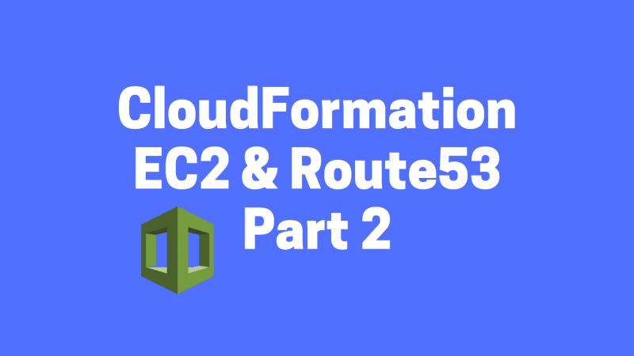
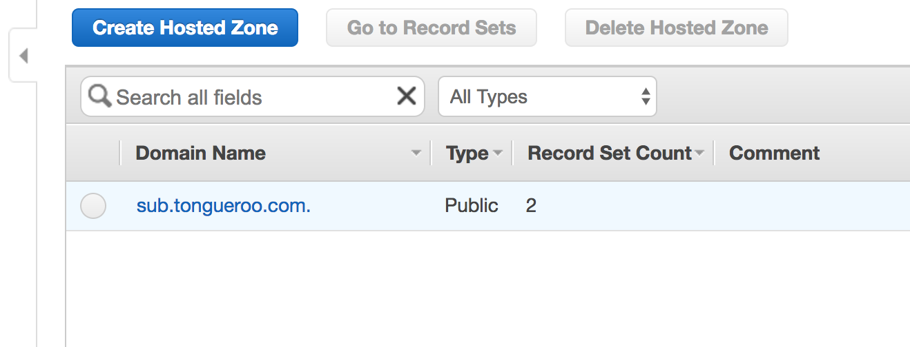

# A Simple Introduction to AWS CloudFormation Part 2: EC2 Instance and Route53

This is a continuation of A Simple Introduction to AWS CloudFormation.

We will build on top of the first simple CloudFormation template from Part 1, which provisions an EC2 instance and Security Group. We will add to it a Route53 record that points to the EC2 instance’s DNS public hostname. This demonstrates CloudFormation’s ability to “orchestrates” the components of the stack. CloudFormation will wait until the EC2 instance’s DNS public hostname is ready and then create the Route53 record pointing to it.

NOTE: All the source code for this post is available on Github: [tongueroo/cloudformation-examples](https://github.com/tongueroo/cloudformation-examples).

## Add Route53 Record to CloudFormation

First let’s take a look at the AWS CloudFormation documentation that covers a [AWS::Route53::RecordSet](https://redirect.viglink.com/?format=go&jsonp=vglnk_157593226770913&key=0d3176c012db018d69225ad1c36210fa&libId=k3z14p150102jk33000DA3sgl3pb1jo48&subId=90a093a441eeed5ed87cea10819eb718&cuid=90a093a441eeed5ed87cea10819eb718&loc=https%3A%2F%2Fblog.boltops.com%2F2017%2F03%2F20%2Fa-simple-introduction-to-aws-cloudformation-part-2-ec2-instance-and-route53&v=1&out=http%3A%2F%2Fdocs.aws.amazon.com%2FAWSCloudFormation%2Flatest%2FUserGuide%2Faws-properties-route53-recordset.html%23cfn-route53-recordset-hostedzonename&title=A%20Simple%20Introduction%20to%20AWS%20CloudFormation%20Part%202%3A%20EC2%20Instance%20and%20Route53%20-%20BoltOps%20Blog&txt=AWS%3A%3ARoute53%3A%3ARecordSet). It provides an example of how to build a Route53 route which we can build from. I’ve taken that example and modified it so that the stack will create a subdomain based on the parameter being passed in.

Here are the simple changes that were needed in order to add this DNS record. First, I added a AWS::Route53::RecordSet resource under the Resources section.

```yaml
  DnsRecord:
    Type: AWS::Route53::RecordSet
    Properties:
      HostedZoneName: !Ref 'HostedZoneName'
      Comment: DNS name for my instance.
      Name: !Join ['', [!Ref 'Subdomain', ., !Ref 'HostedZoneName']]
      Type: CNAME
      TTL: '900'
      ResourceRecords:
      - !GetAtt EC2Instance.PublicIp
```

I also added 2 parameters: HostedZoneName and Subdomain under the Parameters section that the resource requires:

```yaml
  HostedZoneName:
    Description: The route53 HostedZoneName. For example, "mydomain.com."  Don't forget the period at the end.
    Type: String
  Subdomain:
    Description: The subdomain of the dns entry. For example, hello -> hello.mydomain.com, hello is the subdomain.
    Type: String
```

The full code diff is here on GitHub: [add route53 recordset resource](https://github.com/tongueroo/cloudformation-examples/commit/72759e2978240e306838c803db34b7b48d016afa).

This stack requires that the hosted zone in Route53 has already been created. For the purpose of this demo, I’ve created an example.local host zone in Route53.



The route that the CloudFormation stack will create is: testdomain.example.local.
