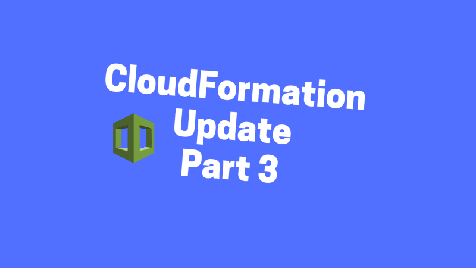

# A Simple Introduction to AWS CloudFormation Part 3: Updating a Stack

In the last 2 stories, we created an EC2 instance and a Route53 record successfully with CloudFormation. We have yet to walk through the useful update-stack command though. In this post, we’ll use the 2 templates created in the first 2 posts to play around with the update-stack command.

NOTE: All the source code for this post is available on Github:
[tongueroo/cloudformation-examples](https://github.com/tongueroo/cloudformation-examples).

# Jumping Right In

We have 2 templates:

1. [single-instance.yml](https://github.com/tongueroo/cloudformation-examples/blob/master/templates/single-instance.yml) — has a single ec2 instance
2. [instance-and-route53.yml](https://github.com/tongueroo/cloudformation-examples/blob/master/templates/instance-and-route53.yml) — has a ec2 instance and route53 record

Let’s first create a stack with the [single-instance](https://github.com/tongueroo/cloudformation-examples/blob/master/templates/single-instance.yml) template with:

```$ aws cloudformation create-stack --stack-name example --template-body file://templates/single-instance.yml --parameters file://parameters/single-instance.json```

You can check on the status of the stack creation via the CloudFormation console.


Now let’s pretend we have updated the single-instance.yml template to the instance-and-route53.yml template and want to update the CloudFormation example stack so that there it will add the route53 record.

You can take a look at the diff of the 2 different templates:

```$ diff templates/single-instance.yml templates/instance-and-route53.yml```

You should see a diff with the added Parameters and DnsRecord Resource like so:

```console
83a84,89
>   HostedZoneName:
>     Description: The route53 HostedZoneName. For example, "mydomain.com."  Don't forget the period at the end.
>     Type: String
>   Subdomain:
>     Description: The subdomain of the dns entry. For example, hello -> hello.mydomain.com, hello is the subdomain.
>     Type: String
387a394,403
>   DnsRecord:
>     Type: AWS::Route53::RecordSet
>     Properties:
>       HostedZoneName: !Ref 'HostedZoneName'
>       Comment: DNS name for my instance.
>       Name: !Join ['', [!Ref 'Subdomain', ., !Ref 'HostedZoneName']]
>       Type: CNAME
>       TTL: '900'
>       ResourceRecords:
>       - !GetAtt EC2Instance.PublicIp
```

# Updating the Stack

Now let’s run the command to update the stack and add the route53 record:

```$ aws cloudformation update-stack --stack-name example --template-body file://templates/instance-and-route53.yml --parameters file://parameters/instance-and-route53.json```

You can check on the status of the stack with the AWS CloudFormation console on the Events tab again:


Notice that CloudFormation smartly added the route53 record and associated it with the DNS public hostname of the instance.

