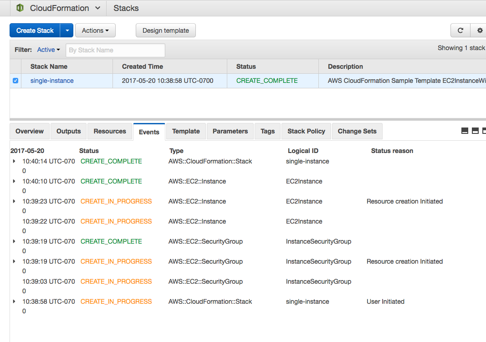

# A Simple Introduction to AWS CloudFormation Part 4: Change Sets = Dry Run Mode

I am a big fan of AWS CloudFormation because it gives you the power to codify the infrastructure and provision it in a repeatable way. One thing that I’ve always wished that CloudFormation had was the ability to see the what changes would be applied ahead of time before hitting that update-stack button. Who wants to hit a big scary red button without knowing what is about to happen? I don’t.

In the puppet world, this preview run is called dry-run or noop mode. In terraform world, this is known as a terraform plan. In response, the AWS team has released something called [Change Sets](https://redirect.viglink.com/?format=go&jsonp=vglnk_157653381123611&key=0d3176c012db018d69225ad1c36210fa&libId=k48z9yq80102jk33000DA14qq0f8d25et&subId=90a093a441eeed5ed87cea10819eb718&cuid=90a093a441eeed5ed87cea10819eb718&loc=https%3A%2F%2Fblog.boltops.com%2F2017%2F04%2F07%2Fa-simple-introduction-to-aws-cloudformation-part-4-change-sets-dry-run-mode&v=1&out=https%3A%2F%2Faws.amazon.com%2Fblogs%2Faws%2Fnew-change-sets-for-aws-cloudformation%2F&title=A%20Simple%20Introduction%20to%20AWS%20CloudFormation%20Part%204%3A%20Change%20Sets%20%3D%20Dry%20Run%20Mode%20-%20BoltOps%20Blog&txt=Change%20Sets).

When I first heard of Change Sets, the name made me think of git changesets. I assumed that this meant I would have to write a “change set” and then apply this change set to the CloudFormation stack. The same way a git patch file can be applied to your source code. This sounded like a lot of work and not what I was looking for. But I’ve had a chance to look at change sets recently, and my understanding of them was completely wrong. CloudFormation Change Sets is dry run mode! It’s AWS way of generating a preview of what the stack update will do. This is exactly what I’ve been looking for.

NOTE: All the source code for this post is available on Github: [tongueroo/cloudformation-examples](https://github.com/tongueroo/cloudformation-examples).

# Previewing Your Changes: dry-run in action

Building upon Part 1, Part 2 and Part 3 blog posts we will use this dry-run ability to preview what will change when we update a stack and add a route53 record to it. We will also preview the deletion of the route53 record.

First, let’s create an example stack to work with:

```$ aws cloudformation create-stack --stack-name example --template-body file://templates/single-instance.yml --parameters file://parameters/single-instance.json```

To create the change set:

```$ aws cloudformation create-change-set --stack-name example --template-body file://templates/instance-and-route53.yml --parameters file://parameters/instance-and-route53.json --change-set-name changeset-1```

You should see output like this:

```json
{
    "StackId": "arn:aws:cloudformation:us-west-2:160619113767:stack/example/7dddd1d0-3ea3-11e7-a894-503ac9841afd",
    "Id": "arn:aws:cloudformation:us-west-2:160619113767:changeSet/changeset-1/4acb3939-5677-4973-a6cb-f5aed16689de"
}
```

Now to see a preview of the changes you use describe-change-set

```aws cloudformation describe-change-set --stack-name example --change-set-name changeset-1 | jq '.Changes[]'```

You should see this output:

```json
{
  "ResourceChange": {
    "Action": "Add",
    "ResourceType": "AWS::Route53::RecordSet",
    "Scope": [],
    "Details": [],
    "LogicalResourceId": "DnsRecord"
  },
  "Type": "Resource"
}
```

You can see that the Changes attribute out of the output confirm that an AWS::Route53::RecordSet DNS record will be added.

You can also view the Change Set in the CloudFormation Console, which is even easier on the eyes. Click on the stack’s “Change Sets” tab and click on the Change Set you just created. Here you can preview the details of the changes.


On the same Change Set Detail page, you can also choose to execute the Change Set right from where you preview it!


# Updating the Stack

This gives you 2 ways to update a stack. You can go back and run the update-stack command as we did in the [Part 3](https://medium.com/boltops/a-simple-introduction-to-cloudformation-part-3-updating-a-stack-6fe2bb3931a9) post. Here is the command again.

```aws cloudformation update-stack --stack-name example --template-body file://templates/instance-and-route53.yml --parameters file://parameters/instance-and-route53.json```

Or you can execute the Change Set from the CloudFormation console, which is super simple. Here’s the equivalent CLI command:

```aws cloudformation execute-change-set --stack-name example --change-set-name changeset-1```

Both ways accomplish the same end result. You get one nice additional benefit if you use ```execute-change-set``` method; it shows that the Change Set was applied and thereby provides a clear audit trail.

# Preview Again: Deleting the Route53 Record

Let’s apply another change set again, this time to remove the route53 record.

```$ aws cloudformation create-change-set --stack-name example --template-body file://templates/single-instance.yml --parameters file://parameters/single-instance.json --change-set-name changeset-2
$ aws cloudformation execute-change-set --stack-name example --change-set-name changeset-2```

You can view the results in the CloudFormation console.



# Summary

Change Sets is such a powerful addition to CloudFormation that I cannot believe it took me so long to realize that it is the dry-run mode holy grail feature that I’ve been waiting for.

After using Change Sets, I’ve realized that it is even better than a dry run. When working alone a dry-run more where you can preview the changes by yourself as a lone developer having the dry-run as part of one command flow makes a lot of sense. However, a huge advantage of change sets is that it gives you the ability to show to your co-workers what changes you are trying to apply to the stack. They can quickly review it in the CloudFormation console and give you the thumbs up or execute it. The fact that it’s viewable in a web browser as well as from the CLI makes it extremely convenient for sharing.
